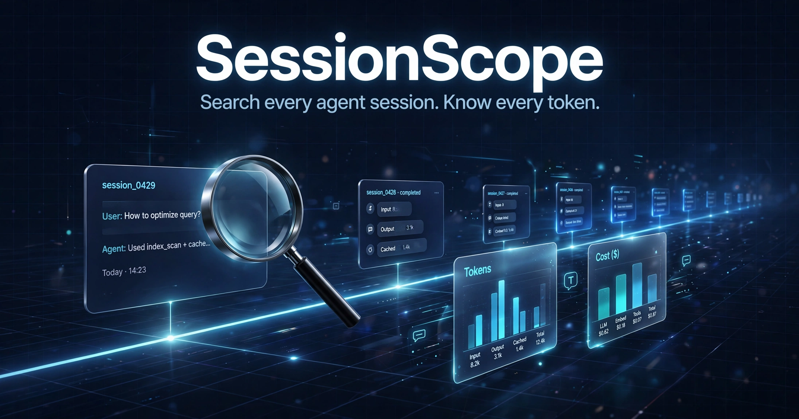
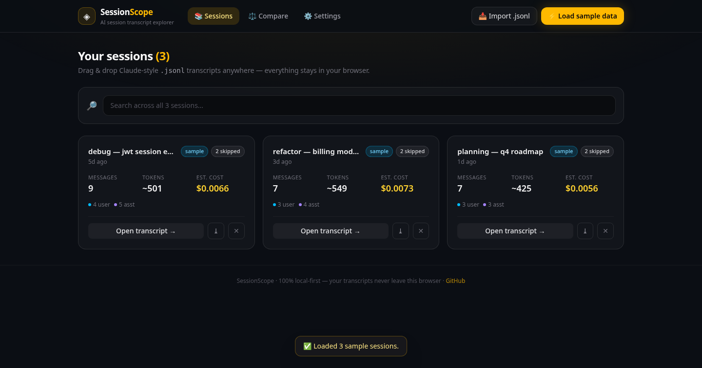

# SessionScope

[](LICENSE)
[](https://vite.dev)
[](https://react.dev)
[](https://www.typescriptlang.org)
[](#)

> Your AI agent sessions, searchable and cost-aware.

SessionScope is a **local-first web app** for exploring Claude-style AI agent session transcripts (`.jsonl`). Drop in transcript files, browse a timeline of sessions with token & cost analytics, full-text search across everything, compare two sessions side by side, and export any session as Markdown.

**🌐 Live demo:** https://devilking7x.github.io/sessionscope/

Everything runs in your browser — no account, no server, no telemetry. Your transcripts never leave your machine.

## ✨ Features

- 📥 **Drag & drop import** — drop `.jsonl` transcripts anywhere on the page; a tolerant parser handles varied message shapes and skips malformed lines instead of crashing
- 📚 **Session timeline** — cards with per-session stats: message count, estimated tokens, estimated cost
- 💰 **Cost analytics** — token estimates (~4 chars/token) priced through an **editable model pricing table** (Settings), persisted in localStorage
- 🔎 **Full-text search** — search across *all* loaded sessions at once, jump straight to the matching message
- 📖 **Transcript explorer** — click a session to read it beautifully rendered: role-colored bubbles, tool-call badges, fenced code blocks, in-transcript search + role filters
- ⚖️ **Session compare** — pick any 2 sessions and compare stats side by side (tokens, cost, role mix, avg cost/message)
- ⤓ **Markdown export** — download any session as a clean `.md` file with a stats header
- ⚡ **One-click sample data** — 3 realistic bundled sessions (debugging, refactor planning, roadmap) so the demo works instantly
- 💾 **Local persistence** — sessions and pricing live in localStorage; clear anytime from Settings

## 🚀 Quick Start

```bash
pnpm install
pnpm dev      # → http://localhost:5173
pnpm build    # → static output in dist/
```

No environment variables, no backend, no database. `pnpm build` produces a fully static site — a GitHub Pages deploy workflow is included (`.github/workflows/deploy-pages.yml`).

## 📄 Transcript format

SessionScope reads **JSONL** transcripts where each line is one JSON message, in the Claude Code style:

```jsonl
{"type":"user","timestamp":"2026-09-20T09:12:03Z","message":{"role":"user","content":[{"type":"text","text":"Help me debug…"}]}}
{"type":"assistant","timestamp":"2026-09-20T09:12:41Z","message":{"role":"assistant","model":"claude-sonnet-4-5","content":[{"type":"text","text":"On it."},{"type":"tool_use","name":"Grep","input":{"pattern":"jwt"}}]}}
```

The parser is deliberately forgiving — it also accepts flat `{role, content}` shapes, plain-string content, `human`/`ai` role aliases, and `created_at` timestamps. Unparseable lines are counted and skipped, never fatal.

## 🛠 Tech stack

- **React 19 + TypeScript** — UI and type-safe transcript parsing
- **Vite 8** — dev server and static build
- **Tailwind CSS v4** — dark premium theme with gold accents
- **localStorage** — the entire "database"

## 📸 Screenshots



*Session cards with token/cost stats · Full-text search across sessions · Transcript explorer with role filters · Side-by-side compare · Editable pricing table*

## 🗺️ Roadmap

- [ ] Per-message cost waterfall ("token forensics")
- [ ] Import `.json` session bundles and share sessions via URL
- [ ] Tagging / project grouping with weekly digest rollups
- [ ] Dark / light theme toggle

Have an idea? [Open an issue](../../issues) or send a PR.

## 📄 License

MIT — see [LICENSE](LICENSE).
